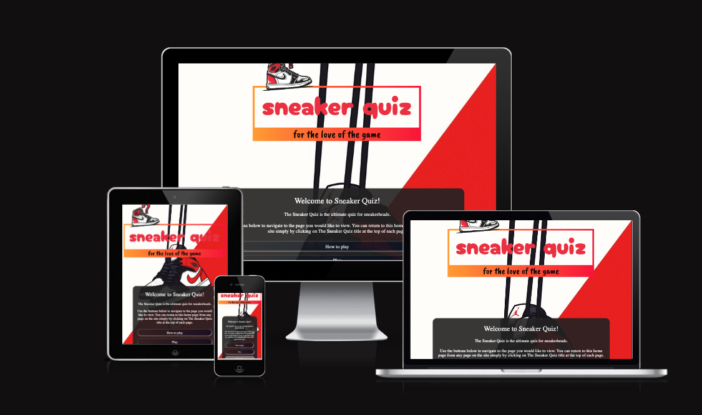

# The Sneaker Quiz

## PROJECT OVERVIEW

[Link to live project](https://smbiko.github.io/sneaker-quiz/) 

Welcome to the Sneaker Quiz, where your passion for sneakers meets the thrill of trivia! Lace up your favorite kicks and get ready to put your sneaker knowledge to the test. From iconic releases to legendary collaborations, this quiz is designed for sneakerheads of all levels. Are you ready to step up to the challenge and prove that you're the ultimate sneaker aficionado? Let's dive in and see if you can ace every question!

## **Table of contents**

- [**The Sneaker Quiz**](#Sneaker Quiz)
  - [**Table of contents**](#table-of-contents)
  - [**Planning**](#planning)
    - [**External user goals**](#external-user-goals)
    - [**Site owner goals**](#site-owner-goals)
    - [**User Stories**](#user-stories)
    - [**Features to achieve the goals**](#features-to-achieve-the-goals)
    - [**Wireframes**](#wireframes)
    - [**Color Scheme**](#color-scheme)
    - [**Fonts**](#fonts)
    - [**Logo and Images**](#logo-and-images)
  - [**Features**](#features)
    - [**Header**](#header)
    - [**Home Page**](#home-page)
    - [**Game Page**](#game-page)
    - [**End Page**](#end-page)
    - [**Highscore Page**](#highscore-page)
    - [**Custom 404 Page**](#custom-404-page)
    - [**Future Enhancements**](#future-enhancements)
- [**Testing**](#testing)
    - [**Manual Testing**](#manual-testing)
    - [**Issues**](#issues)
    - [**Validation**](#validation)
        - [**HTML**](#html)
        - [**CSS**](#css)
    - [**Lighthouse Testing**](#lighthouse-testing)
    - [**Accessibility Testing**](#accessibilty-testing)
    - [**User Story Testing**](#user-story-testing)
- [**Deployment**](#deployment)
- [**Credits**](#credits)
    - [**Content**](#content)
    - [**Media and Design**](#media-and-design)

  ## **Planning**

  ### **External user goals**
  
- I want to take part in a sneaker quiz online and improve my general knowledge. I want to be able to play at any time, anywhere.
- I want the site to be responsive to my device.
- I want the site to be easy to navigate.
- I want to be able to log my high scores to see how I am performing.

  ### **Site owner goals**

  - provide test sneaker heads with whether they understand the general knowledge of sneakers
  - get people to sign up for events
 
    ### **User Stories**

    - As a user, I want to navigate the quiz using multiple devices.
    - As a user, I want to find general information about the quiz.
    - As a user, I want to find out whats my score
    - As a user, I want to find how many questions did I get right and wrong .
    - As a user, I want to find my score after playing the game.
    

### **Features to achieve the goals**

The website is comprised of a home page, a games page, a high scores page, a 404 error page .

All Pages on the website are responsive and have:
    - The website will be built with a mobile-first approach, to ensure it is responsive. I will also test it on various devices and screen sizes.
    - General information about the quiz like how to play  will be included in the home page .
    - A favicon in the browser tab.
    - The title of the site at the top of every page. This title also acts as a link back to the home page.

### **Wireframes**

I created wireframes to visualize my ideas using [Figma](docs/wireframe/wireframe.png) . As I want to stick to the mobile-first approach I created wireframes for mobile.
  
### **Color Scheme**

As the pages of the site have a background image, I wanted to keep the colour scheme used on the site quite small so as to not overwhelm users. Red and white  are very typical colours in use.

Then I used http://colormind.io/to find matching colors for my scheme. After picking out my five main colors I used [contrast-grid.eightshapes.com](https://contrast-grid.eightshapes.com/?version=1.1.0&background-colors=&foreground-colors=%2383a603%0D%0A%231b4001%0D%0A%23f0deb4%0D%0A%23f6f7eb%0D%0A%23001e1d&es-color-form__tile-size=regular&es-color-form__show-contrast=aaa&es-color-form__show-contrast=aa&es-color-form__show-contrast=aa18&es-color-form__show-contrast=dnp) to check the contrast and possible color combinations.

