# The Sneaker Quiz

## PROJECT OVERVIEW

[Link to live project](https://smbiko.github.io/sneaker-quiz/) 

Welcome to the Sneaker Quiz, where your passion for sneakers meets the thrill of trivia! Lace up your favorite kicks and get ready to put your sneaker knowledge to the test. From iconic releases to legendary collaborations, this quiz is designed for sneakerheads of all levels. Are you ready to step up to the challenge and prove that you're the ultimate sneaker aficionado? Let's dive in and see if you can ace every question!

## **Table of contents**

- [**The Sneaker Quiz**](#Sneaker Quiz)
  - [**Table of contents**](#table-of-contents)
  - [**Planning**](#planning)
    - [**External user goals**](#external-user-goals)
    - [**Site owner goals**](#site-owner-goals)
    - [**User Stories**](#user-stories)
    - [**Features to achieve the goals**](#features-to-achieve-the-goals)
    - [**Wireframes**](#wireframes)
    - [**Color Scheme**](#color-scheme)
    - [**Fonts**](#fonts)
    - [**Logo and Images**](#logo-and-images)
  - [**Features**](#features)
    - [**Header**](#header)
    - [**Home Page**](#home-page)
    - [**Game Page**](#game-page)
    - [**End Page**](#end-page)
    - [**Highscore Page**](#highscore-page)
    - [**Custom 404 Page**](#custom-404-page)
    - [**Future Enhancements**](#future-enhancements)
- [**Testing**](#testing)
    - [**Manual Testing**](#manual-testing)
    - [**Issues**](#issues)
    - [**Validation**](#validation)
        - [**HTML**](#html)
        - [**CSS**](#css)
        - [**JS**](#js)
    - [**Lighthouse Testing**](#lighthouse-testing)
    - [**Accessibility Testing**](#accessibilty-testing)
    - [**User Story Testing**](#user-story-testing)
- [**Deployment**](#deployment)
- [**Credits**](#credits)
    - [**Content**](#content)
    - [**Media and Design**](#media-and-design)

  ## **Planning**

  ### **External user goals**

- I want to take part in a sneaker quiz online and improve my general knowledge. I want to be able to play at any time, anywhere.
- I want the site to be responsive to my device.
- I want the site to be easy to navigate.
- I want to be able to log my high scores to see how I am performing.

  ### **Site owner goals**

  - provide test sneaker heads with whether they understand the general knowledge of sneakers
  - get people to sign up for events

    ### **User Stories**

    - As a user, I want to navigate the quiz using multiple devices.
    - As a user, I want to find general information about the quiz.
    - As a user, I want to find out whats my score
    - As a user, I want to find how many questions did I get right and wrong .
    - As a user, I want to find my score after playing the game.

### **Features to achieve the goals**

The website is comprised of a home page, a games page, a high scores page, a 404 error page .

All Pages on the website are responsive and have:
    - The website will be built with a mobile-first approach, to ensure it is responsive. I will also test it on various devices and screen sizes.
    - General information about the quiz like how to play  will be included in the home page .
    - A favicon in the browser tab.
    - The title of the site at the top of every page. This title also acts as a link back to the home page.

### **Wireframes**

I created wireframes to visualize my ideas using [Balsamiq](assets/images/media/colour-schemes.png) . As I want to stick to the mobile-first approach I created wireframes for mobile.

### **Color Scheme**

As the pages of the site have a background image, I wanted to keep the colour scheme used on the site quite small so as to not overwhelm users. Red and white  are very typical colours in use.

Then I used http://colormind.io/ to find matching colors for my scheme. After picking out my five main colors I used [contrast-grid.eightshapes.com](https://contrast-grid.eightshapes.com/?version=1.1.0&background-colors=&foreground-colors=262525%0D%0AEB3947%0D%0AEEEDEC%0D%0A8C928F%0D%0A8C8D93%0D%0A%237C8C7C&es-color-form__tile-size=regular&es-color-form__show-contrast=aaa&es-color-form__show-contrast=aa&es-color-form__show-contrast=aa18&es-color-form__show-contrast=dnp) to check the contrast and possible color combinations.

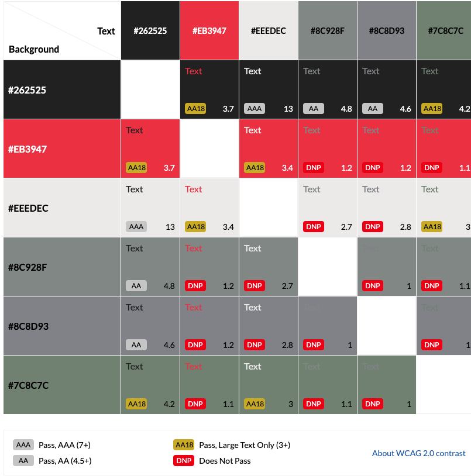

### **Fonts**

Google Fonts was used to import the chosen fonts for use in the site.

- For the Page Title I have used the google font Nova Square. Nova Square  is a stunning font family that offers a wealth of creative possibilities.

- For the body of the page I have used the google font nova square to keep the pages typography uniform.

### **Logo and Images**

After choosing my colors and fonts I wanted to make a simple Logo for my website.

## **Features**

* The title of the site at the top of every page. This title also acts as a link back to the home page.
  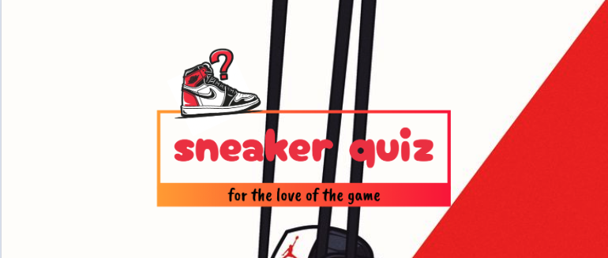

* A favicon in the browser tab.

  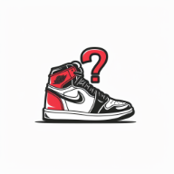

  ### **Home Page**

  The home page of The Sneaker Quiz displays the sites name as a title and then a container which holds some welcome text, including alerting the users that they can navigate back to the home page at any time by clicking on the page name. Below this are three buttons, how to play, play and high scores.

The how to play  button opens a modal showing the user how to play the game. The modal contains a close button which will close the modal, and show the home page again.

The play button will redirect the user to the game page  of their quiz and the high Scores button redirects the user to the high scores page.

### **Game Page**

The game page displays the sites name as a title. This also acts as a link back to the home page. They will then be shown the quiz area. The quiz area contains the question and the 4  answer choices.
When a user selects an answer, they will then be prevented from selecting any more answers. The quiz area border and the button selected will change styles depending on whether the answer selected was correct or incorrect.

### **End Page**

Once a user has answered the 10 questions they will be taken to the end of the game which will allow them to enter their  name and submit it to be entered onto the high scores page if it is in the top 5 scores. The submit button is disabled by default to prevent the user from submitting without a team name. 

### **Highscore Page**

The high scores page displays the sites name as a title. This also acts as a link back to the home page. The page then displays the high scores recorded - showing the name a user chooses and their score. The high scores page will list the top five scores recorded. 

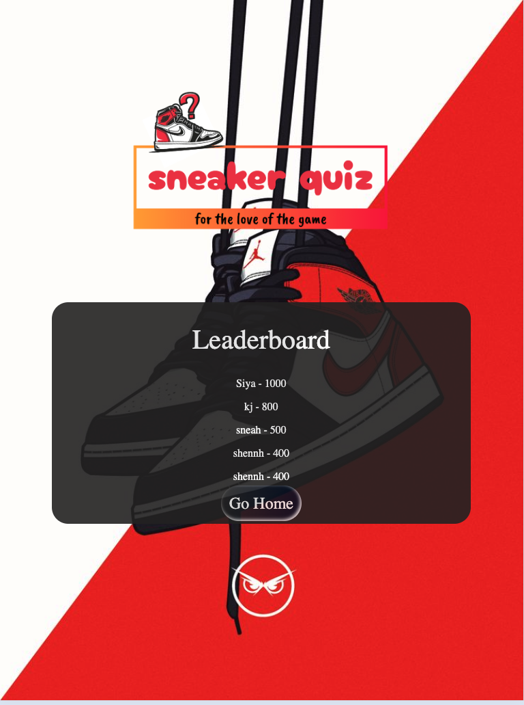

### **Custom 404 Page**

The 404 error page displays the sites name as a title. This also acts as a link back to the home page. Within the page container there is a sorry message explaining to the user that there has been an error directing them to the page they were looking for. 

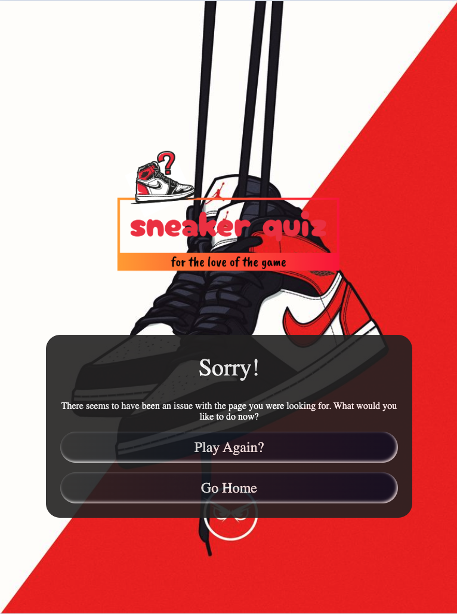

### **Future Enhancements**

In future implementations I would like to

1. Allow users to share their quiz results on social media platforms like Facebook or Twitter.
2. Instead of a fixed set of questions, implement a dynamic question pool where questions are randomly selected from a larger database each time a user takes the quiz. 
3. Allow users to create accounts and log in.
4. Implement different difficulty levels for the quiz, ranging from beginner to expert.

## **Testing**

### **Manual Testing**

During development I made use of google developer tools to ensure everything was working correctly and to assist with troubleshooting when things were not working as expected. While implementing new features I had the website open in **Google Chrome**, resizing the browser using *Dev Tools*. I also opened the website on my phone and tablet after pushing new features.

## **Devices**

Below are the various devices and browsers I tested my website for responsiveness on after it was deployed.

- 24-inch Desktop Monitor

    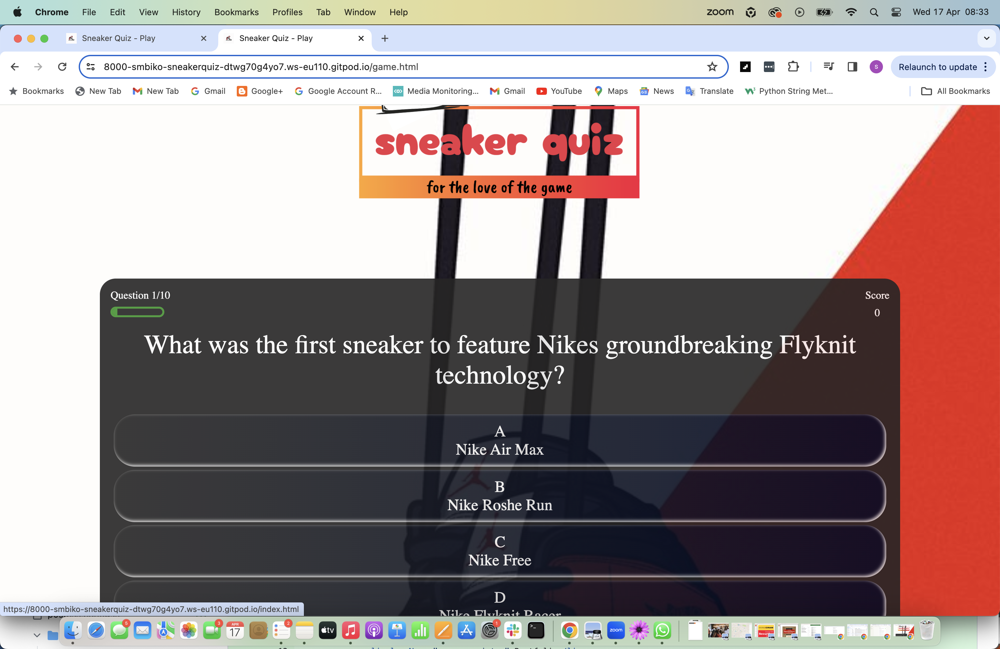

- iPad Pro
    
    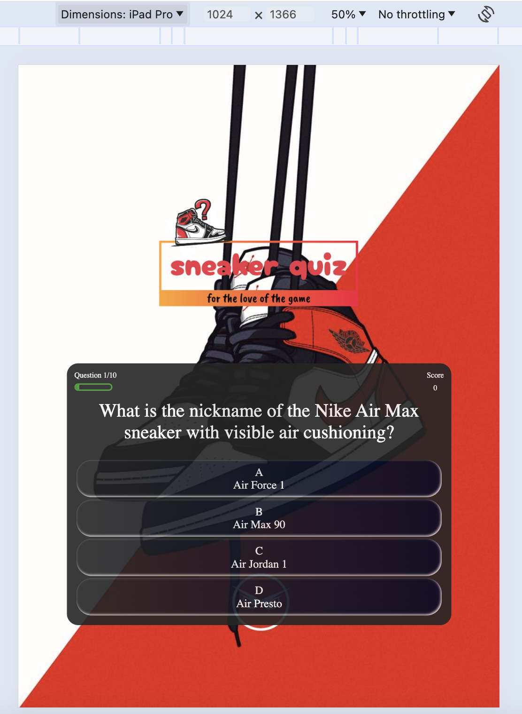
    
- iPhone 12

    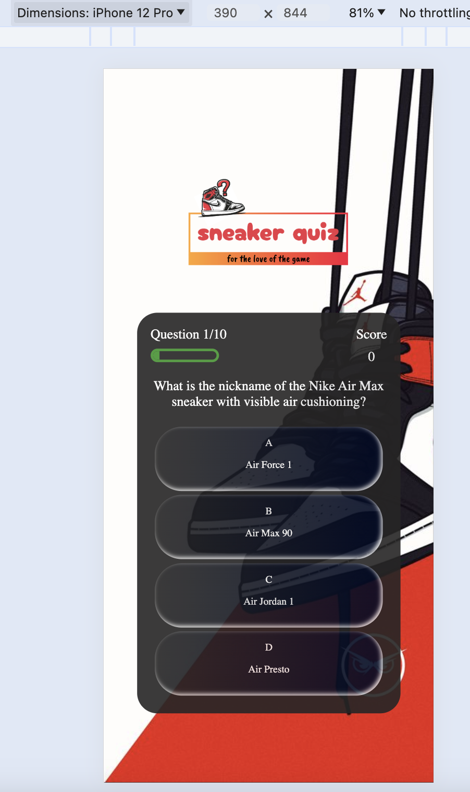

- Samsung S20

    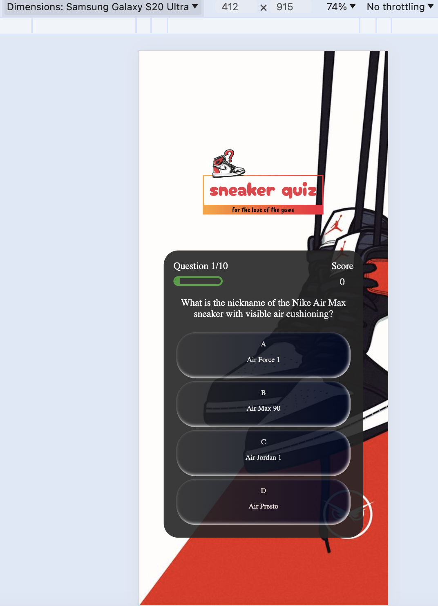

### **Browsers**

- Google Chrome

    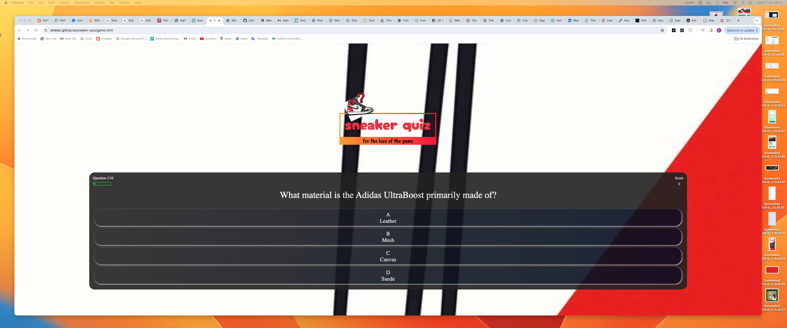

- Safari
    
    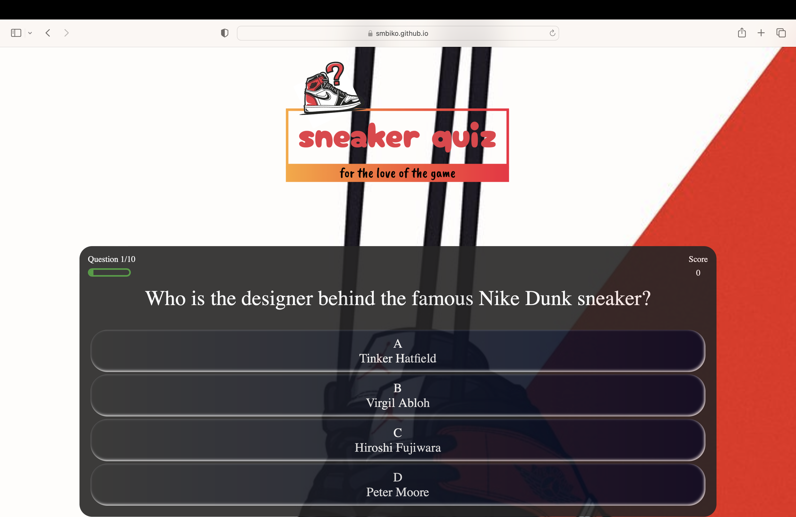

`Home Page`

| Feature | Expected Outcome | Testing Performed | Result | Pass/Fail |
| --- | --- | --- | --- | --- |
| The Sites title | Link directs the user back to the home page | Clicked title | Home page reloads | Pass |
| How to play button | Displays the modal with the instructions on how to play the game | Clicked on button | Modal with instructions on how to play opens | Pass |
| Modal close button | Closes the modal | Clicked on close button | Modal closed | Pass |
| Play Button | Directs the user to the game page | Clicked on button | Game page opens to display the game | Pass |
| High Scores Button | Directs the user to the high scores page | Clicked on button | Directs to the high scores page | Pass |
| All buttons - hover effect | All black buttons with white text should transform the border to highlight. | Hover over each button on the page | Each button displayed the correct styling when hovered over | Pass |

`Game Page - Quiz Area`

| Feature | Expected Outcome | Testing Performed | Result | Pass/Fail |
| --- | --- | --- | --- | --- |
| The Sites title | Link directs the user back to the home page | Clicked title | directed back to home page | Pass |
| All buttons - hover effect | All buttons with a black background & white text should change when hovered over to a background  border colour of white . | Hover over each button on the page | Each button displayed the correct styling when hovered over | Pass |
| Pointer Cursor | The pointer should display when a user moves the mouse over a button | Moved the mouse over each button to check the cursor changed upon entering the button | The cursor changed from the arrow cursor to the pointer cursor | Pass |
| Question populated | The question from the game.js is correctly pulled from the  data |  check that the question has been pulled correctly | The question is displaying | Pass |
| Answers populated | The answers from the game.js are correctly pulled from the  data | check that the answers have been pulled correctly | The answers are displaying | Pass |
| Data attribute correct | The data attribute correct has been applied to the correct answer | By console logging the data I am able to check what the correct answer should be. I can then console.log the id of the buttons to check whether the data attribute has been applied only to the button containing the correct answer | only the correct answer has the correct attribute | Pass |
| Correct answer - button colour | When a correct answer is clicked the button should change background colour to green | Clicked a correct answer | Button background turned green | Pass |
| Incorrect answer - button colour | When an incorrect answer is clicked the clicked buttons background should turn red | Clicked incorrect answer | Button background turned red | Pass |
| Question No counter | The Question No counter should start at 1 and increase by 1 . | answered questions  | Each time the choice is clicked the Answer no counter increases by 1. | Pass |
| Score Counter | The score counter should begin at 0. Each time a correct answer is selected the score should increase by 100. If an incorrect answer is selected the score should remain the same | Clicked a correct answer to check if the score increased. Clicked an incorrect answer to check the score stayed the same| When a correct answer was selected the score increased by 100. When an incorrect score was selected the score stayed the same | Pass |
| Not Allowed Cursor | Once an choice has been selected, the answer buttons should then be disabled  | Clicked on choice button and then clicked on the remaining answer buttons | After the answer was selected each answer button clicked on subsequently could not select the other options | Pass |

`Game Page - End of Quiz`

| Feature | Expected Outcome | Testing Performed | Result | Pass/Fail |
| --- | --- | --- | --- | --- |
| The Sites title | Link directs the user back to the home page | Clicked title | Home page reloads | Pass |
| All buttons - hover effect | All buttons with a black background & white text should change when hovered over to a background that highlights. | Hover over each button on the page | Each button displayed the correct styling when hovered over | Pass |
| Pointer Cursor | The pointer should display when a user moves the mouse over a button | Moved the mouse over each button to check the cursor changed upon entering the button | The cursor changed from the arrow cursor to the pointer cursor | Pass |
| Score Display | The Your Score area should populate with the score you have achieved | I added my score as I played, checked the score on the last question & compared to the score displayed | The score displays correctly | Pass |
| Submit Button - enabled/disabled | The submit button should be disabled and show the not allowed cursor by default. Once the user types their name into the input field the button is enabled | I hovered over and clicked the submit button without filling in the name field. I then added a name, hovered over and clicked the submit button | Without a name filled in the cursor displays as not allowed and the button will not submit. Once I filled in a name the cursor became a pointer when hovered over the button and I was able to click and submit the score | Pass |
| Play again? button | Clicking on this button will return you to the start of the game page where you can play the quiz again | Clicked on the play again? button | Directed to the beginning of the game  | Pass |
| Home button | Clicking on this button will take you back to the home page | Clicked the home button | Directed back to the home page | Pass |

`High Scores Page`

| Feature | Expected Outcome | Testing Performed | Result | Pass/Fail |
| --- | --- | --- | --- | --- |
| The Sites title | Link directs the user back to the home page | Clicked title | Home page reloads | Pass |
| All buttons - hover effect | All buttons with a black background & white text should change when hovered over to a background colour of white with black text. | Hover over each button on the page | Each button displayed the correct styling when hovered over | Pass |
| Pointer Cursor | The Pointer should display when a user moves the mouse over a button | Moved the mouse over each button to check the cursor changed upon entering the button | The cursor changed from the arrow cursor to the Pointer cursor | Pass |
| Score Displayed | If your score is in the top five, your name and score will be displayed in the high scores area in descending order | Played 10+ games and logged a variety of scores. | Once 5 scores were displayed on the high scores board, only scores that were better than the ones logged would then be added to the board | Pass |
| Play again? button | Takes the user to the beginning of the game page to select a difficulty level | Clicked the button | Taken to the beginning of the game page to select a difficulty level | Pass |
| Home button | Takes the user to the home page | Clicked the button | Taken to the home page | Pass |

`404 Error Page`

| Feature | Expected Outcome | Testing Performed | Result | Pass/Fail |
| --- | --- | --- | --- | --- |
| The Sites title | Link directs the user back to the home page | Clicked title | Home page reloads | Pass |
| All buttons - hover effect | All buttons with a black background & white text should change when hovered over to a background colour of white with black text. | Hover over each button on the page | Each button displayed the correct styling when hovered over | Pass |
| Pointer Cursor | The Pointer should display when a user moves the mouse over a button | Moved the mouse over each button to check the cursor changed upon entering the button | The cursor changed from the arrow cursor to the Pointer cursor | Pass |
| Go home button | Takes the user back to the home page | Clicked the button | Taken to the home page | Pass |
| Play button | Takes the user to the beginning of the game page | Clicked the button | Taken to the beginning of the game page to choose a difficulty level | Pass|

### Testing User Stories

| Goals | How are they achieved? |
| :--- | :--- |
| As a user, I want to navigate the quiz using multiple devices. | I have developed the site with responsiveness in mind.|
| As a user, I want to find general information about the quiz. | have added a how to play modal to give information on how to play |
| As a user, I want to find out whats my score. | Added a highscore page to provide highscore and also at the end of the game  |
| As a user, I want to find how many questions did I get right and wrong . | Added a scores on the game and every right answer gains 100 every wrong annswer get 0 points  |
| As a user, I want to find my score after playing the game. | Added a scores at the end of a game so user can find the total and can save it as well.  |

### **Validation**

### **HTML**

I used the [W3C Markup Validation Service](https://validator.w3.org/) to validate my HTML. I originally had some warnings because I had a spaces in between my image titles.

I then renamed the images and most of the errors were rectified . 

The full validation results can be found here:

- [index.html](assets/images/media/testing/w3index.png) - Passed
- [game.html](assets/images/media/testing/w3game.png) - Passed
- [highscore.html](assets/images/media/testing/w3highscore.png) - Passed
- [end.html](assets/images/media/testing/w3end.png) - Passed
- [404.html](assets/images/media/testing/w3404.png) - Passed

### **CSS**

[W3C](https://validator.w3.org/) was used to validate the HTML on all pages of the website. It was also used to validate the CSS.

### **JS**

[jshint](https://jshint.com/) was used to validate the JavaScript.

* [javascript.js](assets/images/media/testing/jshintmodal.png) - Passed.
* [game.js](assets/images/media/testing/jshintgame.png)- Passed with most warnings about semi colons needed Javascript does not need to have semi colons . . It also stated that there are 4 unused variables, however these are being used.
* [highscores.js](assets/images/media/testing/jshinthighscore.png) - Passed.
* [end.js](assets/images/media/testing/jshintend.png) - Passed.

### Lighthouse

I used Lighthouse within the Chrome Developer Tools to test the performance, accessibility, best practices and SEO of the website.

### Results

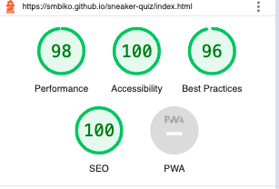

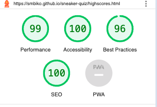

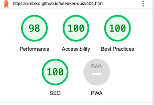

## **Deployment**

I followed my mentor's tip and deployed my website early, after implementing the header. The steps to deploying a website on GitHub pages are:

1. Open the [repository](https://github.com/smbiko/sneaker-quiz.git and go to the **Settings** tab.
2. Navigate to the **Pages** tab in the left menu.
3. Choose **Deploy from a branch** and select the according branch, *main* in my case.
4. Click save. The link to the deployed website can then be found in the [repository](https://github.com/smbiko/sneaker-quiz.git) on the right menu under **Environments**.

The link to my live site is: [The Sneaker Quiz](https://smbiko.github.io/sneaker-quiz/index.html)

## **Credits**

Thanks to my Code Institute Mentor Jubril Mentor for giving me valuable feedback and tips during this project.

### **Content**

- The content was written by myself and. using chatGPT  the images on the  .
- I adapted my hamburger menu from a video with the according [Codepen](https://codepen.io/kevinpowell/pen/jxppmr) from Kevin Powell.

### **Media and Design**

- The images used for the website are taken from my past events held in 2023 and compressed using [iloveimg](https://www.iloveimg.com/) .
- [Pixelied](https://pixelied.com/) was used to convert images to the *.webp* format.
- I used Balsamiq to create Wireframes.
- With [colormind.io](http://colormind.io/) I created a color scheme and used [contrast-grid.eightshapes.com] to check the contrast and possible color combinations.
- The fonts were downloaded from Google Fonts.
- The screenshot at the top of this document was taken from Am I Responsive?.
-The Logo was designed on [Logo](https://logo.com/logos/artificial-intelligence) I used the colours from the background image 

